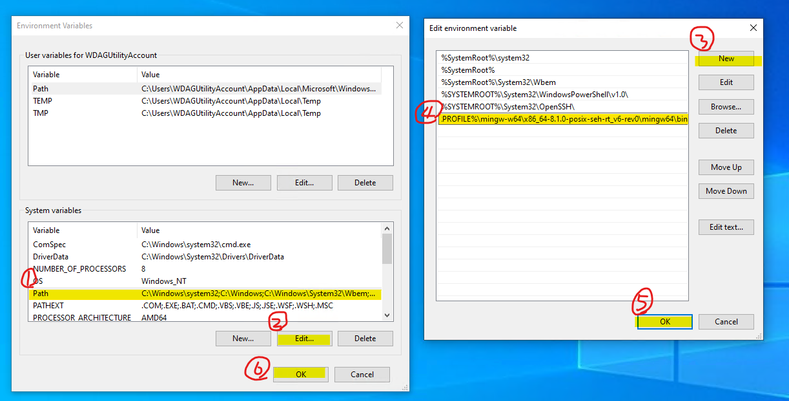
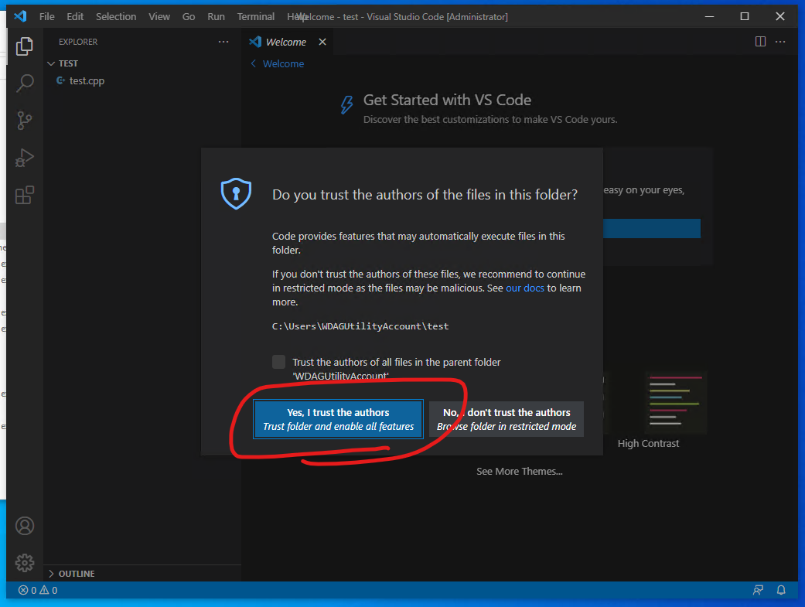
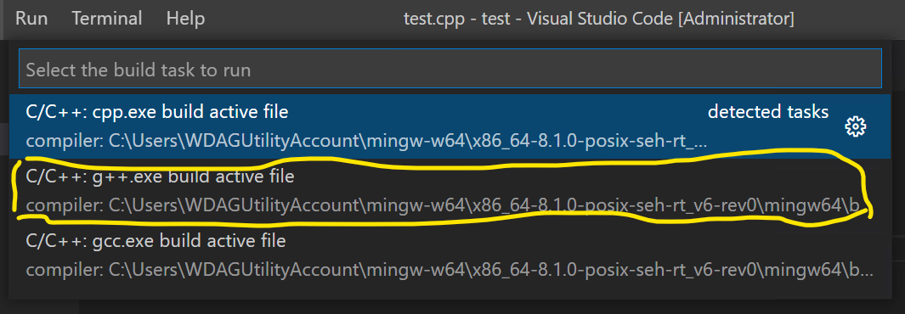
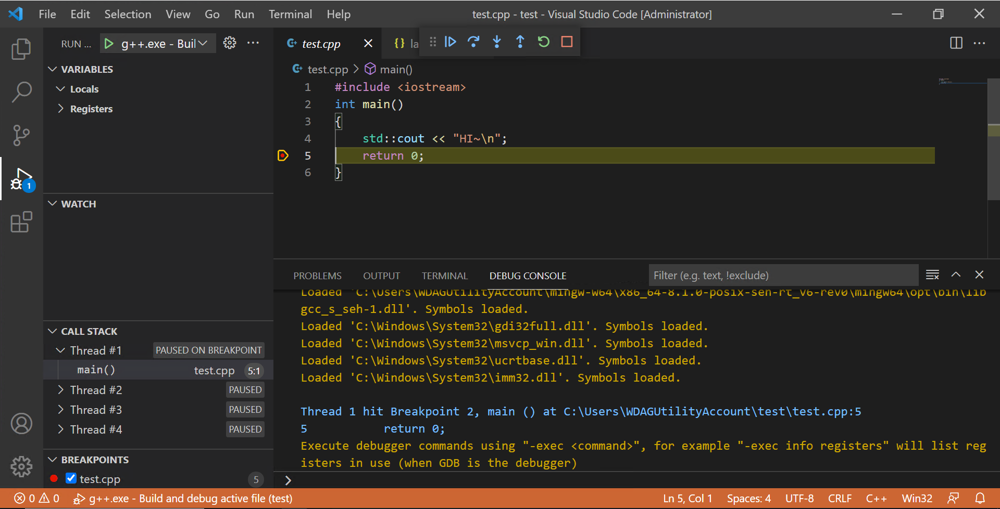

### 安裝步驟

1. 下載[vscode-all-in-one.zip](https://github.com/CNOCycle/cpp_tutorial/releases/download/win-mingw-vscode/vscode-all-in-one.zip)
2. 解壓縮縮後，將檔案放到路徑`%USERPROFILE%`
3. 將`%USERPROFILE%\mingw-w64\x86_64-8.1.0-posix-seh-rt_v6-rev0\mingw64\bin`加入到環境變數`Path`
4. 完成

### 圖解說明

* `%USERPROFILE%` 是windows的環境變數，指的是該電腦使用者的目錄。
概念同linux底下的`${HOME}`。
以本台測試電腦為例，該電腦使用者為`WDAGUtilityAccount`，則`%USERPROFILE%`=`C:\Users\WDAGUtilityAccount`。
正常請況下在檔案總管上的路徑列輸入`%USERPROFILE%`後會自動跳轉。如下圖示範：

* 將檔案放到路徑`%USERPROFILE%`，如下圖示範：

* 將`%USERPROFILE%\mingw-w64\x86_64-8.1.0-posix-seh-rt_v6-rev0\mingw64\bin`加入到環境變數`Path`，如下圖示範：

文字版流程:

1. 在「搜尋」中，搜尋並選取：系統 (控制台)
2. 按一下進階系統設定連結。
3. 按一下環境變數。在系統變數區段中，找到 PATH 環境變數並加以選取。按一下編輯。如果 PATH 環境變數不存在，請按一下新增。
4. 在編輯系統變數 (或新增系統變數) 視窗中，指定 PATH 環境變數的值。按一下確定。按一下確定，將其餘的視窗全都關閉。

NOTE: `%USERPROFILE%\mingw-w64\x86_64-8.1.0-posix-seh-rt_v6-rev0\mingw64\bin` 的順序是有差的，請確認是在最下方才是正確的。
若不是可以使用右側的 `上移`、`下移` 調整順序。

### 測試編譯以及除錯

#### 測試編譯

1. 用`vscode`編輯器選擇開啟解壓縮檔案裡面的`test`資料夾，如下圖示範：

NOTE: 如果電腦上沒有 `test` 資料夾，需要在 `%USERPROFILE%` 中新增一個資料夾，名稱可以自由取。

2. 信任開啟檔案，選擇`Yes, I trust`，如下圖示範：

3. 點擊左方test.cpp檔案後，在第5行左側按下去，會出現紅點，如下圖示範：

4. 按下`ctrl+shift+B`按鍵，或上方`terminal -> Run Build Task`，如下圖示範：

5. 此時上方會出現以下畫面，選擇中間選項使用 **g++** 編譯檔案，如下圖示範：

6. 設置正確的話，此時下方會出現編譯成功完成的提示，如下圖示範：

#### 測試除錯

1. 完成前項`測試編譯`的所有流程

2. 按下左方三角形按鈕後選擇`Run and Debug`，如下圖示範：

3. 此時上方會依序出現相關提示，選擇預設的即可，如下圖示範：

4. 若設定正確的話，會看到程式停留在選取的第5行，如下圖示範：

