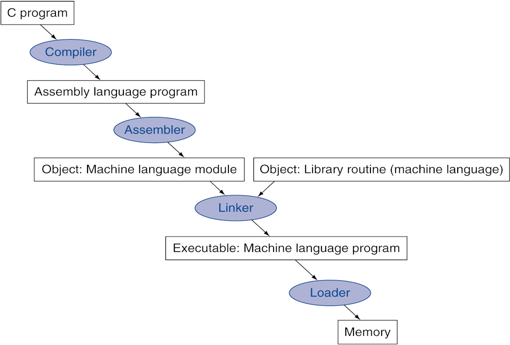

# Lecture 1-1: Introduction to Programming & C++

## 從 Source Code 到執行檔


Credit: Computer Architecture by 黃婷婷老師

### Text Editor

程式碼其實就是一般的純文字檔，為了能夠讓程式設計師有更好的效率撰寫程式，因此寫程式的編輯器會增加其他的功能輔助，例如自動縮排、關鍵字變色、甚至檢查語法錯誤等。

常見的程式編輯器有 Notepad++ 、 Atom 、 VS Code 等。

### Compiler  

是程式語言的核心工具，用來將你寫的 C/C++ 程式碼變成讓電腦能夠執行的指令。
此外還負責指令的最佳化，讓執行效率提升。

### Linker  

是用來將編譯好的指令連結成電腦能夠執行的執行檔。因為除了我們自己寫的程式碼之外，無可避免一定會用到許多已經編譯好的指令—— Library (函式庫)。
在現實的情況下，不可能每一東西都要靠自己創造，所以絕大多數的時候我們都會使用內建的或別人寫好的函式庫，來達到自己想要的功能。 
Linker 就是用來把我們的程式碼和需要的函式庫裡的程式碼連結在一起，形成單一的可執行檔。
在 Windows 裡，執行的的副檔名為 `.exe`，macOS/Linux 則是給予執行權限即可執行。

### Loader

是用來將執行檔載入給電腦，並實際讓電腦執行你的執行檔。
可以想像是在桌面上點兩下 `.exe` 檔案， Loader 概念與這個類似。

## 程式執行

所有的程式都是從指令列執行。
現在常見的圖形介面程式都是從指令列程式擴充而來的。

例如在桌面上點兩下 `a.exe` 檔案其實是告訴系統說 “請執行 `a.exe`”，系統會透過 Loader 將 `a.exe` 載入並且執行。
這時僅有指令列，如果要顯示圖形化介面， `a.exe` 需要加入其他函式庫告訴系統 “`a.exe` 有圖形化介面，內容分別是...”。

```console
$ firefox
.......
.......
^C
$
```

## C++ 語言架構

``` c++
// import std::cout & std::endl
#include <iostream>
/* 
start of define main function
void: no input arguments
int: return value in int type
*/
int main(void){
    // print "Hello world!" on the terminal
    std::cout << "Hello world!" << std::endl;
    // return execute status back to the system
    // `0` means the program executed successfully
    return 0;
// end of define main function
}
```

```console
$ ./a.out
Hello world!
$
```

### `#include <iostream>`

### `int main(void){}` & `return 0;`

### `std::cout` & `<<`

### `std::endl`

### `return 0;`


Reference:
* [htchen/i2p-nthu by 陳煥宗老師](https://github.com/htchen/i2p-nthu/tree/master/程式設計一)
* [Computer Architecture by 黃婷婷老師](https://ocw.nthu.edu.tw/ocw/index.php?page=course&cid=76)